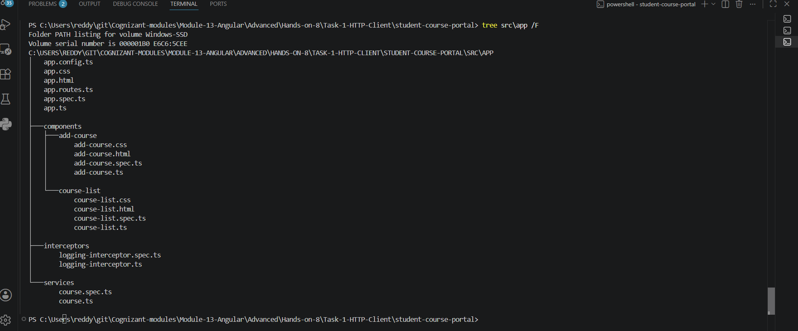
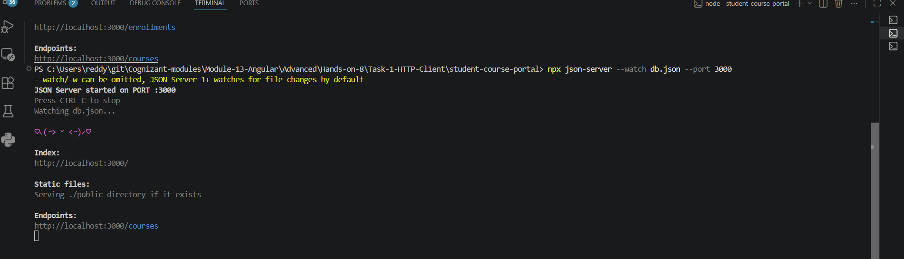
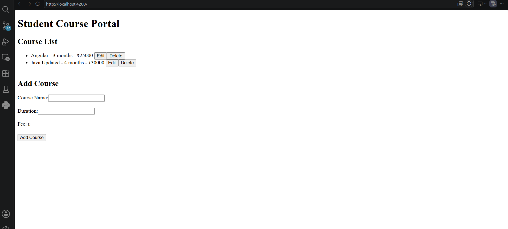
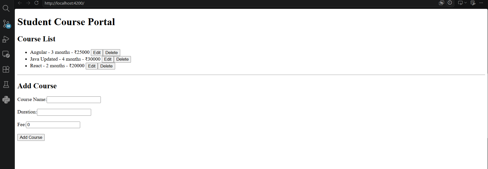
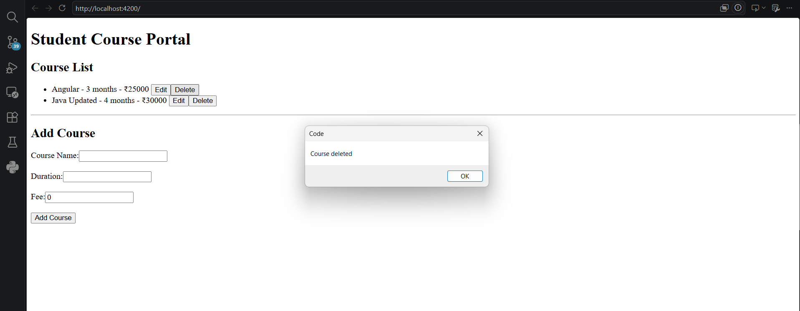
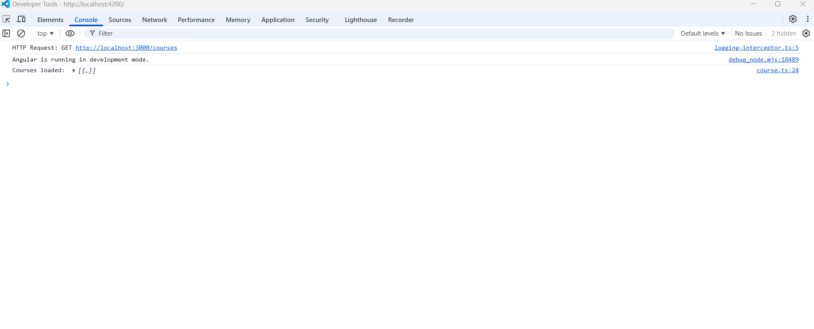

# Hands-on 8 - Task 1: HTTP Client API Integration

## Objective
Implement Angular HTTP Client communication with a backend API using JSON Server.

## Topics Covered
- HttpClient setup using provideHttpClient()
- GET, POST, PUT and DELETE operations
- Observables and subscribe()
- RxJS operators
- Error handling
- HTTP Interceptors

## Implementation

### Course Service
Created CourseService using HttpClient to perform API operations:

- GET courses
- Add new course
- Update course
- Delete course

### Backend
Used JSON Server as a mock REST API.

API Endpoint:

http://localhost:3000/courses

### Components Created

- CourseListComponent
- AddCourseComponent

### Interceptor

Created Logging HTTP Interceptor to monitor API requests.

## Screenshots

### Project Structure

### JSON Server

### GET Courses

### POST Add Course

### DELETE Course

### HTTP Interceptor
