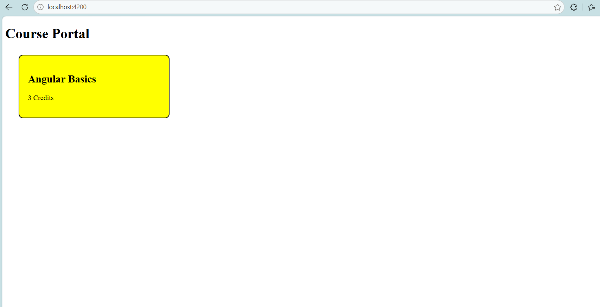
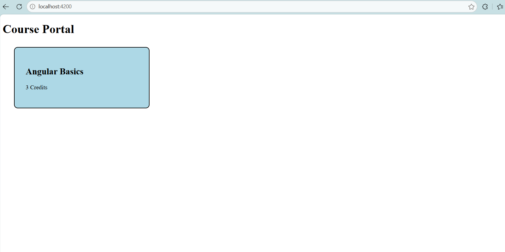
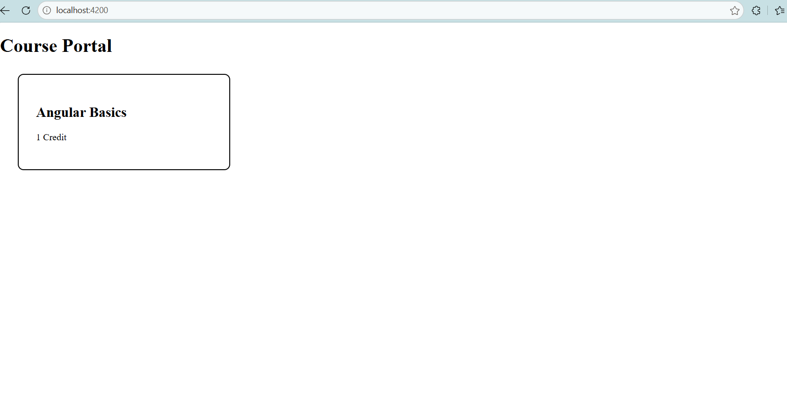
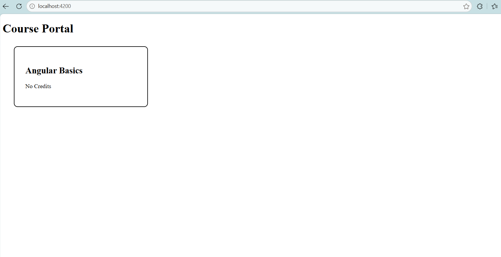

# Task 3 - Custom Directive and Custom Pipe

## Objective
Create a reusable custom attribute directive and custom pipe for the Angular course portal.

## Features Implemented

### Custom Highlight Directive
- Created using Angular CLI.
- Uses `@HostListener` for mouseenter and mouseleave events.
- Highlights course cards on hover.
- Supports configurable highlight colors using `@Input()`.

Examples:
- Default highlight: Yellow
- Custom highlight: Lightblue

### Custom Credit Label Pipe
Created a custom pipe to convert credits into readable text.

Examples:
- 1 → 1 Credit
- 2+ → Credits
- 0 / null → No Credits

## Screenshots

### Yellow Highlight

### Custom Lightblue Highlight

### Credit Pipe Output

## Technologies Used
- Angular
- TypeScript
- HTML
- CSS