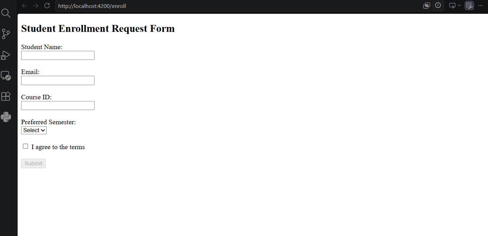
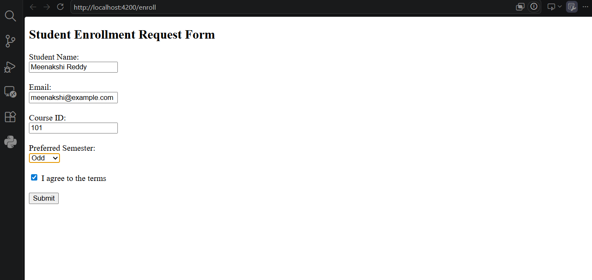
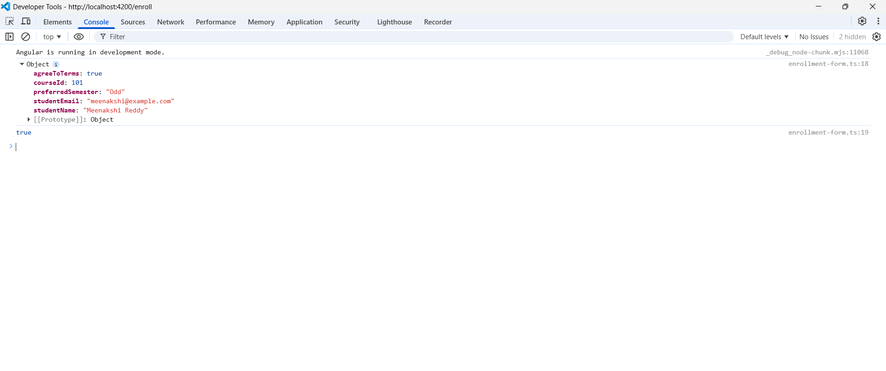

# Task 1: Build the Enrollment Request Form

## Objective
Build a Student Enrollment Request Form using Angular Template-Driven Forms with `ngModel`, `ngForm`, and form validation.

## Features
- Created an Enrollment Form component.
- Used `FormsModule` for template-driven forms.
- Added two-way data binding using `[(ngModel)]`.
- Created fields for:
  - Student Name
  - Student Email
  - Course ID
  - Preferred Semester
  - Agree to Terms
- Used `ngForm` to manage form state.
- Disabled the Submit button when the form is invalid.
- Logged `form.value` and `form.valid` to the browser console on successful submission.

## Screenshots

### Enrollment Form

### Filled Form

### Console Output

## Result
Successfully implemented a Template-Driven Form with Angular `FormsModule`, `ngModel`, `ngForm`, and form submission handling.
