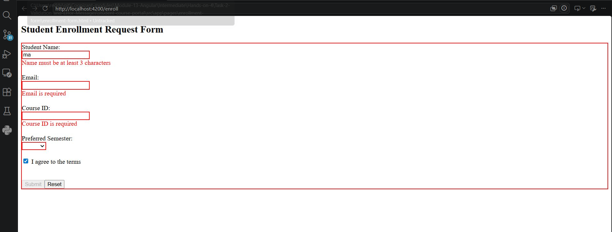
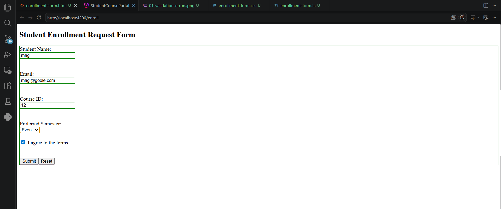
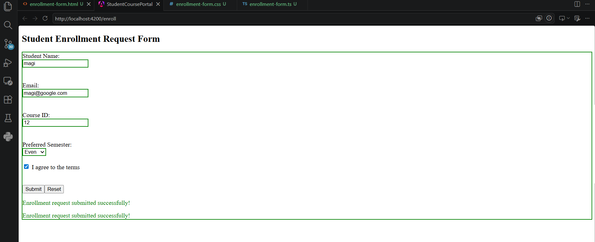
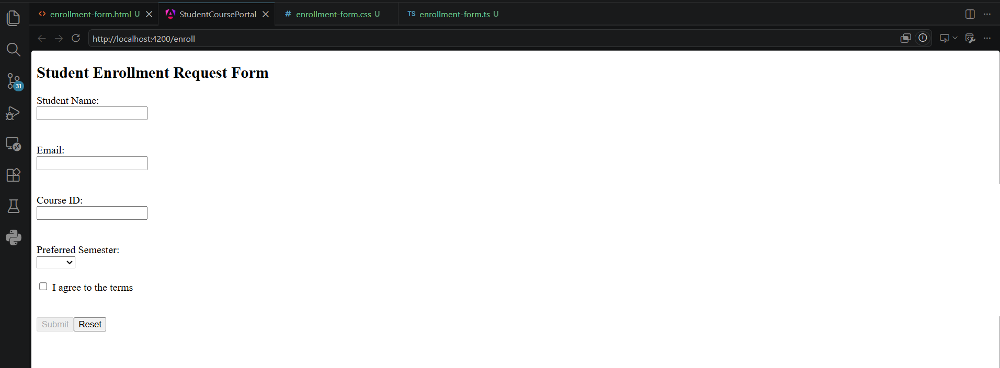

# Validation and Error Messages

## Objective
Enhance the Student Enrollment Request Form by adding built-in Angular validators, displaying contextual validation messages, styling form controls based on validation state, and handling successful submission and form reset.

## Features
- Added built-in validators:
  - required
  - minlength
  - email
- Displayed validation error messages using `*ngIf`.
- Styled invalid fields with red borders.
- Styled valid fields with green borders.
- Displayed a success message after successful form submission.
- Added a Reset button to clear the form and validation states.

## Screenshots

### Validation Errors

### Valid Form

### Success Message

### Reset Form

## Result
Successfully implemented Angular Template-Driven Form validation, contextual error messages, form styling, submission feedback, and reset functionality.