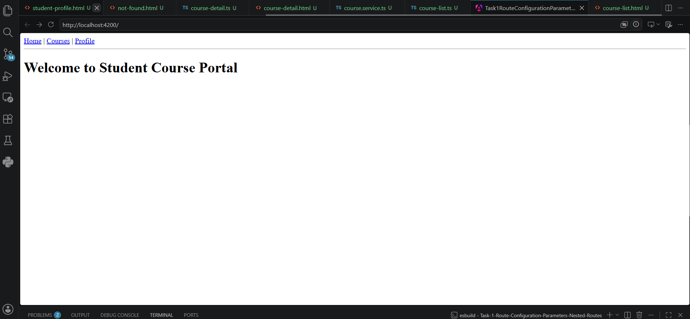
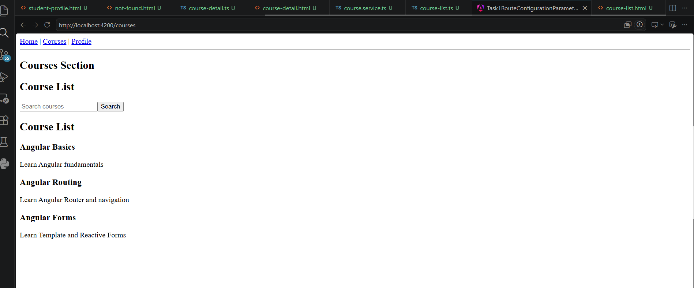
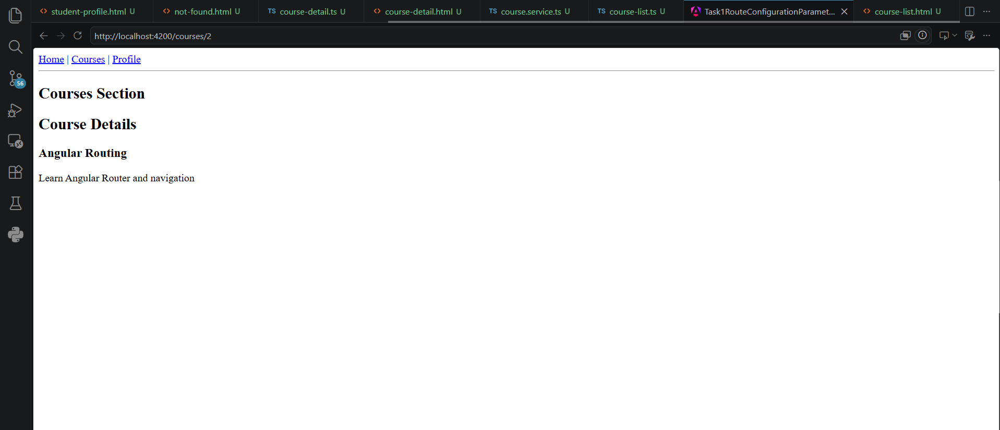
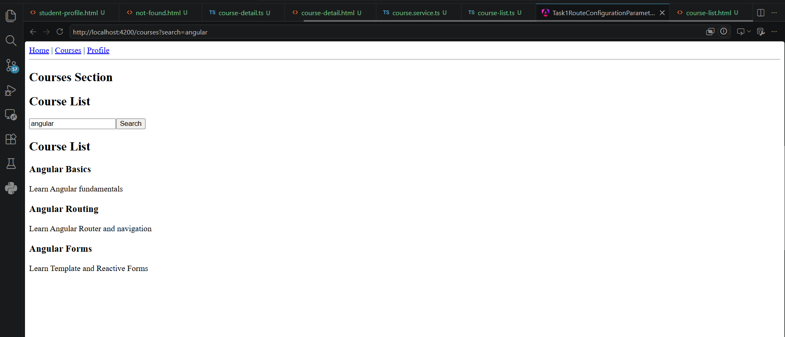
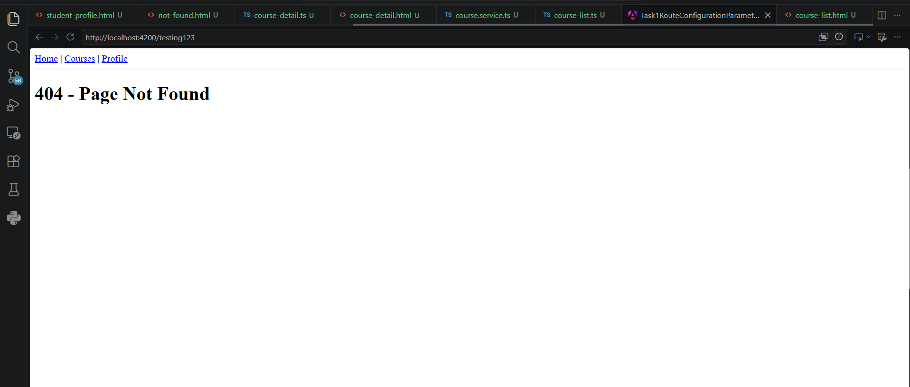

# Hands-on 7 - Task 1: Angular Routing — Guards, Lazy Loading & Route Data

## Topic
Angular Routing — Route Configuration, Parameters and Nested Routes

## Objective
To configure Angular application routes, implement route parameters, query parameters, nested routes, and handle unknown routes using Angular Router.

---

## Technologies Used

- Angular v20.0
- TypeScript
- HTML
- CSS
- Angular Router

---

# Implementation Details

## 1. Route Configuration

Configured application routes using `app.routes.ts`.

Implemented routes:

| Route | Component | Purpose |
|---|---|---|
| `/` | HomeComponent | Displays home page |
| `/courses` | CoursesLayoutComponent | Parent route for courses |
| `/courses/:id` | CourseDetailComponent | Displays selected course details |
| `/profile` | StudentProfileComponent | Displays student profile |
| `**` | NotFoundComponent | Handles invalid routes |

---

## 2. Nested Routes

Created nested routing under the courses route.

Structure:

```
/courses
    |
    ├── CourseListComponent
    |
    └── CourseDetailComponent
```

`CoursesLayoutComponent` contains:

```html
<router-outlet></router-outlet>
```

to display child routes.

---

## 3. Route Parameters

Implemented dynamic course details using route parameters.

Example:

```
/courses/2
```

The course id is accessed using:

```typescript
this.route.snapshot.paramMap.get('id')
```

The corresponding course details are loaded using:

```typescript
CourseService.getCourseById()
```

---

## 4. Course Navigation

Each course card is clickable.

Navigation is implemented using:

```typescript
this.router.navigate(['courses', id])
```

Clicking a course redirects to:

```
/courses/:id
```

---

## 5. Query Parameters

Implemented course search using query parameters.

Example:

```
/courses?search=angular
```

Query parameter navigation:

```typescript
this.router.navigate(
 ['courses'],
 {
   queryParams:{
     search:this.searchTerm
   }
 }
)
```

Reading query parameter:

```typescript
this.route.snapshot.queryParamMap.get('search')
```

---

## 6. Services

Created `CourseService` to manage course data.

Features:

- Get all courses
- Get course by id

Methods:

```typescript
getCourses()

getCourseById(id)
```

---

# Project Structure

```
src/app
│
├── pages
│   ├── home
│   ├── course-list
│   ├── course-detail
│   ├── courses-layout
│   ├── student-profile
│   └── not-found
│
├── services
│   └── course.service.ts
│
├── app.routes.ts
└── app.ts
```

---

# Screenshots

## Home Page




## Course List Page




## Course Detail Page




## Query Parameter Search




## Not Found Page




---

# Learning Outcome

After completing this task, I learned:

- How to configure routes in Angular standalone applications
- How Angular Router enables SPA navigation
- How to use route parameters
- How to implement nested routes
- How to use query parameters
- How to handle unknown routes using wildcard routing
- How to navigate programmatically using Router service

---

# Conclusion

The Angular application successfully implements routing with dynamic parameters, query parameters, nested routes, and fallback routing using Angular Router.